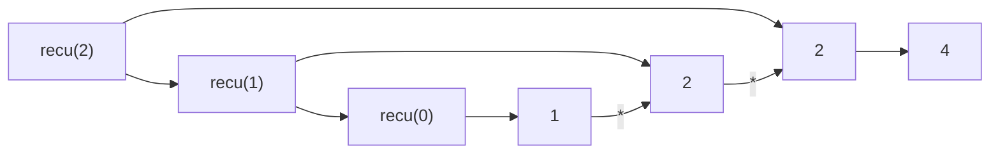
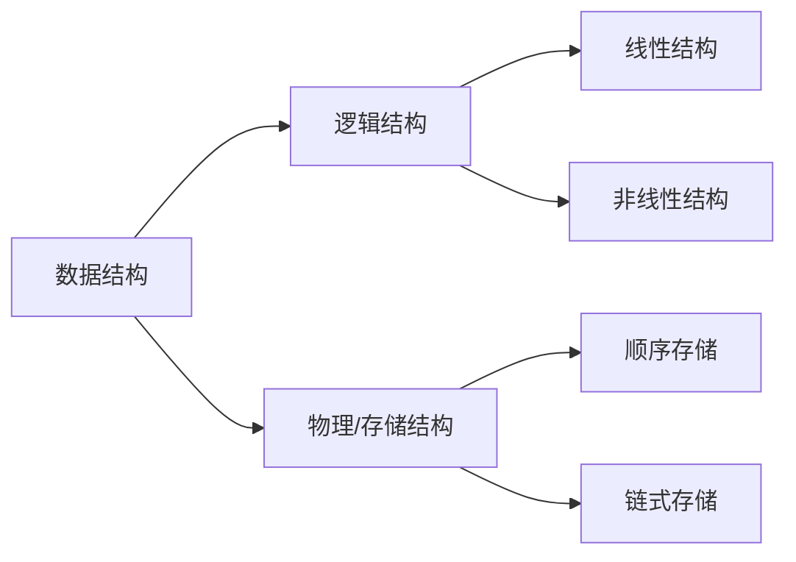

# :blue_book: 第一章 绪论

这里我们将进行第一章的学习，主要回顾本课程需要用到的基本数学知识、Java 程序设计的递归语法和基本的算法复杂度分析方法。

## 前言

为什么要学数据结构？或许大部分的课程的一开始都会讨论这个问题，可能大家的心里第一个反应是：

_因为要考试，所以要学这门课_ :neutral_face: 。

的确，大学的任何一门课程都是需要考试或考察来验证你对于这门课程的掌握情况，且在专业学习中不可替代的作用。

实际上，数据结构与算法支撑着我们生活的方方面面，如购票系统、外卖点单等，可以说，任何涉及到信息系统的领域都需要数据结构的支持，并运用算法来进行问题解决。

就数据结构与算法这门课来说，不论是”信息管理与信息系统“还是”大数据“专业，《数据结构与算法》都是专业最为重要的内容，
一方面是对《程序设计基础》和《计算机导论》等课程的巩固，另一方面是为了下一阶段进一步学习《人工智能》、《计算机网络》和《数据库设计》等进阶课程的必备先修课程。

就如课程介绍中所提到的，作为一门承上启下的课程，在正式学习这门课程之前，需要你掌握一定的知识，我们将在本章节中将你需要掌握最基本的知识进行复习，
例如数学知识，特别是基本的高等数学的内容；再者，考虑到所授课专业的课程设置，本课程主要的语言媒介是 Java，为了加强大家课程学习的效率，
还将简要回顾一下 Java 中面向对象编程，递归，以及泛型等基础知识。

## 数学

本节将简要的列出基本的数学基本公示以及需要了解的知识，以便于后面知识的学习。

### 指数

指数在数学中较为常用，例如$X^A$,$2^N$等等，我们简要回忆一下之前的一些基本运算规则：

$$
X^A X^B=X^{A+B}
$$

$$
\frac{X^A}{X^B} = X^{A-B}
$$

$$
(X^A)^B=X^{AB}
$$

$$
2^N+2^N=2^{N+1}
$$

### 对数

在表示大范围数据时，对数则比一般数要简单一些，同样我们回顾一些基本规则：

$$
\log_A B = \frac{\log_c B}{\log_c A}
$$

$$
\log AB = \log A + \log B
$$

$$
\log \frac{A}{B} = \log A - \log B
$$

$$
\log(A^B)=B\log A
$$

### 级数

级数一般指数据项依次累加起来的函数，例如连续级数：

$$
\sum_{i=0}^N 2^i = 2^{N+1}-1
$$

连续数之和：

$$
\sum_{i=1}^N i = \frac{N(N+1)}{2} \approx \frac{N^2}{2}
$$

诸如此类的级数在后续进行算法复杂度分析时，我们将使用到。

## Java 相关

学习这门课的同学大多数应该先修过《程序设计基础》这门课，并在这门课学习了 Java 语言的基础，应该可以使用 Java 编写简单的功能，例如：

```java
public class Main {
    public static void main(String[] args) {

        System.out.println("Hello world!");
    }
}
```

即可得到我们熟悉的 Hello World

### 面向对象编程

相对于部分同学们可能接触到的语言，如 C 等，Java 最大的优势在于面向对象的特性。例如数据，实体等需要在系统中表示或抽象的内容都可以使用面向对象的方式
对其进行概述，例如下述代码描述了最基本的面向对象思想，定义了一个人以及姓名、性别的函数。诸如此类思想将在数据结构的设计中经常使用。

```java
public class Person {

    private String name;
    private int gender;
    private int age;

    public String getName() {
        return name;
    }

    public String getGender() {
        return gender == 0 ? "Man" : "Woman";
    }
}

```

诸如**接口**（Interface）等方法也在 Java 中常常使用:
定义接口

```java
/* 定义接口 : Animal.java */
interface Animal {
   public void eat();
   public void travel();
}
```

使用接口

```java
/* 文件名 : MammalInt.java */
public class MammalInt implements Animal{

   public void eat(){
      System.out.println("Mammal eats");
   }

   public void travel(){
      System.out.println("Mammal travels");
   }

   public int noOfLegs(){
      return 0;
   }

   public static void main(String args[]){
      MammalInt m = new MammalInt();
      m.eat();
      m.travel();
   }
}
```

### 递归

在学习《程序设计基础》时，可能会有一道经典的题目供大家思考，即：

```java
public class Main {
    public static void main(String[] args) {

        System.out.println("The output is:" + recu(2));
    }

    public static int recu(int x) {
        if (x == 0) {
            return 1;
        } else {
            return 2 * recu(x - 1);
        }
    }
}
```

这里就用到了递归的思想，经演算推出应为 4



实际上我们可以看到的是，递归就是调用自身函数来运行函数，这一点普遍存在于现代的编程语言中，如：Java, C++/C/C#, Kotlin 等语言中。
需要注意的是，尽量不要选择使用复杂的递归逻辑，这会使你的代码理解起来非常困难，一般而言，递归都需要指定停止标识以终止递归，如示例中当`x=0`
时。

尽量不要使用下述无线递归的语法，以避免错误。

:::danger 错误的递归

```java
public class Main {
    public static void main(String[] args) {

        System.out.println("The output is:" + recu(2));
    }

    public static int recu(int x) {
        if (x == 1) { //该条件某些情况下无法达成
            return 1;
        } else {
            return 2 * recu(x / 3) + x - 1;
        }
    }
}
```

:::

### 泛型

泛型（Generics）作为 JDK 5 中引入的面向对象的一个重要特性，主要用以解决面向对象编程过程中，变量类型与编译器转型安全问题。
例如常见的使用`ArrayList<T>`形式来定义不同类型的数组等，由于我们接下来所学习的算法中，可能会操纵不同的数据，为了避免为每一种类型的数据编写同样的代码。
我们将多次使用泛型的思想进行算法设计，下面展示了一个最为简单的泛型类，其中 T 即为泛型表示，其实可以发现，当把换成 int,
double 等关键字后，这就是
一个普通的类。泛型还有较多其他的特性，例如一般使用 Object 类进行泛型实现等。
进一步可参见[廖雪峰老师的教程](https://www.liaoxuefeng.com/wiki/1252599548343744/1265102638843296)

```java
class Pair<T> {
    private T first;
    private T last;

    public Pair(T first, T last) {
        this.first = first;
        this.last = last;
    }

    public T getFirst() {
        return first;
    }
}

public class Main {
    public static void main(String[] args) {
        Pair<Integer> temp = new Pair<>(1, 2);//Java 7提供了简化为<>菱形标识符的特性，避免重复代码。
        System.out.println("The output is:" + temp.getFirst());
    }
}
```

## 从数组开始

接下来我们来看一段稍早前就已经学习过的代码。

```java
public class Main {
    public static void main(String[] args) {
        int[] a = {1, 2, 3, 4, 5, 6, 7, 8, 9};
        System.out.println("The output is " + a[1]);
        a[1] = 5;
        System.out.println("The output is " + a[1]);
    }
}
```

这个代码定义了一个数组，先输出了数组的第二个元素，并修改了第二个元素。这就涉及到了 Java 中最基础的数据结构——数组。
可以看出，数组中是一系列同类数据的集合，并且有其规定的次序，当然数组的可操作性是有限的，Java 中还有包括更高级的`Array`类
来实现更高级的操作。但本质上这些数据结构都包含了一些常见基本的操作，如：增加、删除、修改等。实际上反映了 ==_物理上_== 数据如何存储。
为了更好地理解数据结构本身的性质，我们需要在逻辑上定义相应的数据结构，这里首先引入抽象数据类型(Abstract Data Type, ADT)
的概念。

## 抽象数据类型

**抽象数据类型**(Abstract Data Type, ADT)是带有一组特定操作的对象的集合，可以视作是数学层面的抽象，它并不关注特定语言算法的实现，
而更注重相关的逻辑操作，例如增加(add)，删除(delete)，修改(modify)，查找(find)等等，常用于数据结构的表示，更多体现的是
==_逻辑上_== 元素的组织及操作。在 Java 语言的设计中，也有类似 ADT 的实现，但是对其实现的细节进行了适当的隐藏。

## 逻辑结构与物理结构

在数组和抽象数据类型的介绍中，我们提到逻辑概念和物理概念，这两者实际上对应了计算机在数据存储时的逻辑结构与物理结构(物理结构也称存储结构)。 其中，逻辑结构反应的是数据的逻辑组成，是具体操作层面的表示，而物理结构则是数据在计算机的物理介质(硬盘、内存)等中的存储方式，是物理层面的数据结构。 例如我们常说的数组指的就是逻辑结构，而表则包含了逻辑结构和物理结构两层含义。

我们可以通过以下图来简要划分一下即将学习的数据结构中逻辑结构与物理结构，本课程将会陆续介绍线性结构和非线性结构，以及他们对应的存储方式（即顺序存储和链式存储），后续我们将详细介绍每种数据结构的逻辑结构，以及其对应的物理结构。



:::info 说明
在部分教材的讲授中，值得注意的是，顺序和散列还可以进一步进阶为散列结构和索引结构。
:::

## 算法分析

我们在编写代码的过程中，可以通过不同的实现方式完成相似的功能，但不同的实现方式，其运行效率往往大相径庭，
为了更好的度量所设计的算法程序的效率，我们需要构建一个公平的模型对程序指令运行的总体效率进行度量。
一般来说算法的分析一般是对算法程序的运行复杂度进行度量，大多数情况下认为包括运行时间和空间占用。
可以这么理解，运行时间与程序执行语句的次数直接相关，而空间占用与程序申请的空间大小直接相关。
随着计算机存储能力和性能的提升，在大部分情况下，人们更偏向于分析程序的运行时间，而不深究空间占用，
甚至会牺牲空间占用来换取运行时间的提升，本课程大多数情况下分析的也均是运行时间。
:::note 注
并不是说空间占用分析没有意义，在单片机、嵌入式系统开发等存储受限的情景中，空间分析同样非常重要！同时优秀的空间占用设计也有助于降低算法复杂度。
:::

程序的运行时间受到如机器指令集、硬盘访存速度、内存速度、CPU 频率等因素的影响。在算法的分析过程中，很难去定义某一台机器的配置，
为了合理的分析算法能力，我们假定存在一台计算机，所设计的所有算法都在上面运行，从而简化内存、硬盘、CPU 等因素对程序运行的影响。

### 时间复杂度

在解释这个概念之前，我们来看一个具体的问题：
::: warning 问题 1.1: 排序数组
现有一给定的无序数组，给出排序后的数组，例如：$1, 2, 0, -1, -3$ 应返回$-3, -1, 0, 1, 2$。
:::
这是一道经典的题目，其解法将在后续的课程中给出多种方式进行解释。而现阶段，对于这个问题的求解，最为简单的是，直接对所有的数据进行遍历，不断将最大的
数字放到最后，我们考虑一个极端的情况，假设每个数字都需要比较最多的次数到自己的目标位置，那最多需要 $0+1+2+...+(n-1)=\frac{(
n-1)(n-2)}{2}=\frac{n^2-3n-2}{2}$次

但是如果我们将数字分为$k$个组，每个数据都放到某个组中，并保持组内有序，那最坏的情况则是需要比较$n+k$次即可，这里我们可以发现对于同样的数据，实际上
其算法实现效率是不一样的，这种直接体现在移动次数上的效率，实际上也是程序执行效率的体现。一般来说，我们可以认为程序语句执行次数等价于时间复杂度。
:::info
上述算法实际上是冒泡排序的最坏情况和桶排序的一般情况，后续将进一步介绍。
:::

### 大 O 表示法

在前一节的例子中，我们可以看出，实际上常数项和低阶数对于最终程序直接效率比较没有明显的关系。因此，为了简化算法分析，大家约定不进行特定时间单位的制定，
而是通过计算程序语句的执行次数，并舍弃常数项、低阶项来度量效率，一般以最坏的情形来进行估计，这样的方式称之为大 O 表示法。
再看一个代码例子：

```java
public class Main {
    public static void main(String[] args) {
        System.out.println("The output is:" + sum(9)); //执行1次
    }

    public static int sum(int n) {
        int tempSum; //执行1次
        tempSum = 0; //执行1次
        for (int i = 1; i < n; i++) { //执行1次
            tempSum += i; //执行n次
        }
        return tempSum; //执行1次
    }
}
```

我们可以看到程序除去函数语句外的逻辑语句总计执行了$n+4$次，根据前面的约定，那这个程序的实现复杂度为$O(N+4)$，简化后为$O(N)
$。但是实际代码中
不仅仅包含这些语句，往往有更为复杂的逻辑需要分析。为此，我们要先达成一些的规则约定来更好的进行分析。

:::tip 时间复杂度规则

- **循环**：for\do while\while 循环的执行次数，就是其中循环语句执行的次数，记做$O(N)$;
- **循环嵌套**：注意当发生循环的嵌套时，则其复杂度为嵌套数的 N 次方，例如双层循环的复杂度为$O(N^2)$（提示：强烈建议不要进行多层循环嵌套）;
- **顺序语句**：当发生多种语句组合时，一般先统计不同组合的运行复杂度，最后取最大级数作为整体的复杂度即可；
- **if/else 语句**：一般来说，条件语句合理的情况下，对于条件预计的时间复杂度计算取两个条件语句中最复杂的部分；
  :::

  我们可以从下图看出时间复杂度对计算负载的影响，随着计算规模（横轴）的增大，时间复杂度更大的程序将面临爆发式的执行次数（纵轴）增长。
  
  常见的复杂度计数包括：$O(logN),O(N!),O(NlogN)$等，在后续的课程中，我们将结合实际数据结构和算法进行深入分析。

:::info 拓展阅读
除大$O$表示法以外，还包括大$\Omega$表示法用以度量最好情况和大$\Theta$表示法用以度量精确结果，具体参见《算法导论》的
[3.1 节渐近记号](https://open.163.com/newview/movie/free?pid=M6UTT5U0I&mid=M6V2T4T2E)部分。
:::
