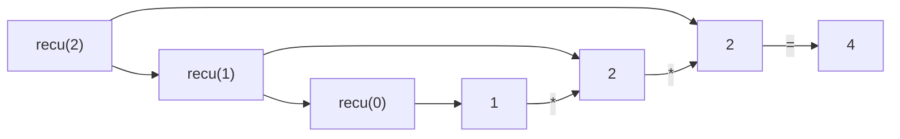

# 第一章 绪论

这里我们将进行第一章的学习，主要回顾本课程需要用到的基本数学知识和 Java 程序设计的递归语法。

## 前言

为什么要学数据结构？或许大部分的课程的一开始都会讨论这个问题，可能大家的心里第一个反应是：

*因为要考试，所以要学这门课* :neutral_face: 。

的确，大学的任何一门课程都是需要考试或考察来验证你对于这门课程的掌握情况，且在专业学习中不可替代的作用。

实际上，数据结构与算法支撑着我们生活的方方面面，如购票系统、外卖点单等，可以说，任何涉及到信息系统的领域都需要数据结构的支持，并运用算法来进行问题解决。

就数据结构与算法这门课来说，不论是”信息管理与信息系统“还是”大数据“专业，《数据结构与算法》都是专业最为重要的内容，一方面是对《程序设计基础》和《计算机导论》等课程的巩固，另一方面是为了下一阶段进一步学习《人工智能》、《计算机网络》和《数据库设计》等进阶课程的必备先修课程。

就如课程介绍中所提到的，作为一门承上启下的课程，在正式学习这门课程之前，需要你掌握一定的知识，我们将在本章节中将你需要掌握最基本的知识进行复习，例如数学知识，特别是基本的高等数学的内容；再者，考虑到所授课专业的课程设置，本课程主要的语言媒介是Java，为了加强大家课程学习的效率，还将简要回顾一下Java中面向对象编程，递归，以及泛型等基础知识。

## 数学

本节将简要的列出基本的数学基本公示以及需要了解的知识，以便于后面知识的学习。

### 指数

指数在数学中较为常用，例如$X^A$,$2^N$等等，我们简要回忆一下之前的一些基本运算规则：

$$
X^A X^B=X^{A+B}
$$

$$
\frac{X^A}{X^B} = X^{A-B}
$$

$$
(X^A)^B=X^{AB}
$$

$$
2^N+2^N=2^{N+1}
$$

### 对数

在表示大范围数据时，对数则比一般数要简单一些，同样我们回顾一些基本规则：

$$
\log_A B = \frac{\log_c B}{\log_c A}
$$

$$
\log AB = \log A + \log B
$$

$$
\log \frac{A}{B} = \log A - \log B
$$

$$
\log(A^B)=B\log A
$$

### 级数

级数一般指数据项依次累加起来的函数，例如连续级数：

$$
\sum_{i=0}^N 2^i = 2^{N+1}-1
$$

连续数之和：

$$
\sum_{i=1}^N i = \frac{N(N+1)}{2} \approx \frac{N^2}{2}
$$

诸如此类的级数在后续进行算法复杂度分析时，我们将使用到。

## Java相关

学习这门课的同学大多数应该先修过《程序设计基础》这门课，并在这门课学习了Java语言的基础，应该可以使用Java编写简单的功能，例如：

```java
public class Main {
    public static void main(String[] args) {

        System.out.println("Hello world!");
    }
}
```

即可得到我们熟悉的Hello World

### 面向对象编程

相对于部分同学们可能接触到的语言，如C等，Java最大的优势在于面向对象的特性。例如数据，实体等需要在系统中表示或抽象的内容都可以使用面向对象的方式对齐进行概述，例如下述代码描述了最基本的面向对象思想，定义了一个人以及姓名、性别的函数。诸如此类思想将在数据结构的设计中经常使用。

```java
public class Person {

    private String name;
    private int gender;
    private int age;

    public String getName() {
        return name;
    }

    public String getGender() {
        return gender == 0 ? "Man" : Woman ";
    }
}

```

### 递归

在学习《程序设计基础》时，可能会有一道经典的题目供大家思考，即：

```java
public class Main {
    public static void main(String[] args) {

        System.out.println("The output is:" + recu(2));
    }

    public static int recu(int x) {
        if (x == 0) {
            return 1;
        } else {
            return 2 * recu(x - 1);
        }
    }
}
```

这里就用到了递归的思想，经演算推出应为4



实际上我们可以看到的是，递归就是调用自身函数来运行函数，这一点普遍存在于现代的编程语言中，如：Java, C++/C/C#, Kotlin等语言中。
需要注意的是，尽量不要选择使用复杂的递归逻辑，这会使你的代码理解起来非常困难，一般而言，递归都需要指定停止标识以终止递归，如示例中当`x=0`
时。

尽量不要使用下述无线递归的语法，以避免错误。

:::danger 错误的递归

```java
public class Main {
    public static void main(String[] args) {

        System.out.println("The output is:" + recu(2));
    }

    public static int recu(int x) {
        if (x == 1) { //该条件某些情况下无法达成
            return 1;
        } else {
            return 2 * recu(x / 3) + x - 1;
        }
    }
}
```

:::

### 泛型
泛型（Generics）作为JDK 5中引入的面向对象的一个重要特性，主要用以解决面向对象编程过程中，变量类型与编译器转型安全问题。
例如常见的使用`ArrayList<T>`形式来定义不同类型的数组等，由于我们接下来所学习的算法中，可能会操纵不同的数据，为了避免为每一种类型的数据编写同样的代码。
我们将多次使用泛型的思想进行算法设计，下面展示了一个最为简单的泛型类，其中T即为泛型表示，其实可以发现，当把换成int, double 等关键字后，这就是
一个普通的类。泛型还有较多其他的特性，进一步可参见[廖雪峰老师的教程](https://www.liaoxuefeng.com/wiki/1252599548343744/1265102638843296)
```java
class Pair<T> {
    private T first;
    private T last;

    public Pair(T first, T last) {
        this.first = first;
        this.last = last;
    }

    public T getFirst() {
        return first;
    }
}
public class Main {
    public static void main(String[] args) {
        Pair<Integer> temp = new Pair<>(1, 2);//Java 7提供了简化为<>菱形标识符的特性，避免重复代码。
        System.out.println("The output is:" + temp.getFirst());
    }
}
```

## 算法分析
算法的分析一般是对算法的运行复杂度进行度量，包括时间复杂度和空间复杂度等。可以这么理解，时间复杂度与程序执行语句的次数直接相关，而空间复杂度与程序
占用的空间大小直接相关。随着计算机存储能力和性能的提升，在大部分情况下，人们更偏向于分析程序的时间复杂度，而不深究空间复杂度，
甚至会牺牲空间复杂度来换取时间复杂度的提升，本课程大多数情况下分析的也均是时间复杂度。
