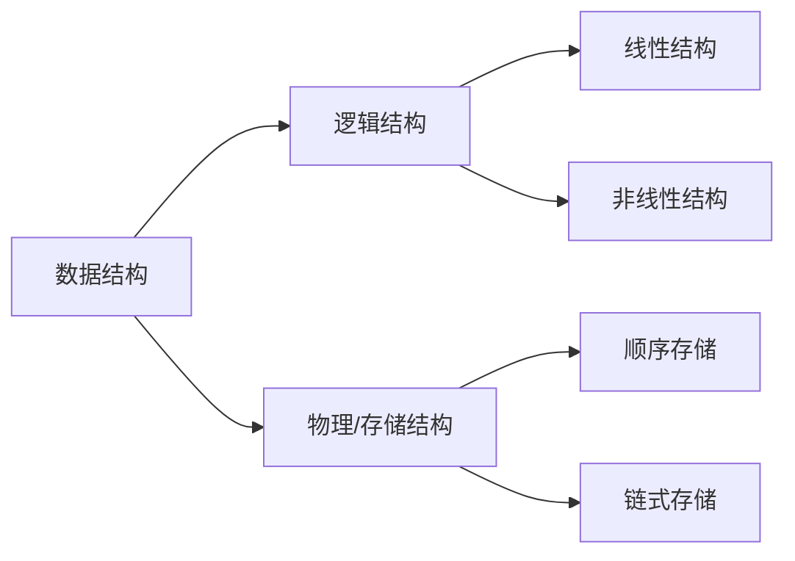

# :blue_book: 第二章 表(List)

本章主要讨论介绍最简单的数据结构：表，重点通过这个大家可能已经接触过的数据结构来介绍抽象数据类型、逻辑结构和物理结构等概念，
并且对于这三种数据结构的基本操作进行介绍。最后结合Java中重要的库类`ArrayList`和`LinkedList`进一步开展实战。

## 从数组开始

在开始本章内容之前，我们先来看一段稍早前就已经学习过的代码。

```java
public class Main {
    public static void main(String[] args) {
        int[] a = {1, 2, 3, 4, 5, 6, 7, 8, 9};
        System.out.println("The output is " + a[1]);
        a[1] = 5;
        System.out.println("The output is " + a[1]);
    }
}
```

这个代码定义了一个数组，先输出了数组的第二个元素，并修改了第二个元素。这就涉及到了Java中最基础的数据结构——数组。
可以看出，数组中是一系列同类数据的集合，并且有其规定的次序，当然数组的可操作性是有限的，Java中还有包括更高级的`Array`类
来实现更高级的操作。但本质上这些数据结构都包含了一些常见基本的操作，如：增加、删除、修改等。实际上反映了 ==*物理上*== 数据如何存储。
为了更好地理解数据结构本身的性质，我们需要在逻辑上定义相应的数据结构，这里首先引入抽象数据类型(Abstract Data Type, ADT)
的概念。

## 抽象数据类型

**抽象数据类型**(Abstract Data Type, ADT)是带有一组特定操作的对象的集合，可以视作是数学层面的抽象，它并不关注特定语言算法的实现，
而更注重相关的逻辑操作，例如增加(add)，删除(delete)，修改(modify)，查找(find)等等，常用于数据结构的表示，更多体现的是 ==
*逻辑上*== 元素的组织及操作。在Java语言的设计中，也有类似ADT的实现，但是对其实现的细节进行了适当的隐藏。

## 逻辑结构与物理结构

在数组和抽象数据类型的介绍中，我们提到逻辑概念和物理概念，这两者实际上对应了计算机在数据存储时的逻辑结构与物理结构(
物理结构也称存储结构)。 其中，逻辑结构反应的是数据的逻辑组成，是具体操作层面的表示，而物理结构则是数据在计算机的物理介质(
硬盘、内存)
等中的存储方式，是物理层面的数据结构。 例如我们常说的数组值得就是逻辑结构，而表则包含了逻辑结构和物理结构两层含义。

我们可以通过以下图来简要划分一下即将学习的数据结构中逻辑结构与物理结构，后续我们将详细介绍每种数据结构的逻辑结构，以及其对应的物理结构



## 表

在本课程中，我们将形式如$A_0,A_1,A_2,...,A_N$的一般数据所组成的连续数据集合的逻辑结构称之为**表(List)**，
我们前述的数组也是一种表的物理结构表示。为了便于表述，我们将长度为0的表称之为空表，其中没有任何元素。并将$A_i$称之为$A_
{i+1}$的前驱(previous)，将$A_{i+1}$称之为$A_{i}$的后继(next)。与之相对的，我们可以抽象一系列的操作，例如定义`printList`
来打印整个列表，定义`makeEmpty`清空列表，定义`find`根据下标来找回值，定义`insert`来在指定位置插入值，定义`remove`
移除指定位置的元素[^1]。

### 顺序表

顺序表又称顺序存储结构，专门用以存储一对一的数据。在是表这一逻辑结构在物理存储上的一种形式，所存储的应是一整块内存空间中的有次序的数据。
一般来说，顺序表的内存分配应当是连续的，因此在物理结构上是有连续次序的，因此，称之为顺序表。


:::info 注意 对于顺序表这个概念，在部分的以 Java 为编码语言教材中并没有刻意强调，与 C/C++ 等语言相比，由于 Java
的虚拟机机制，数据在内存中"顺序"并没有如 C/C++ 中体现那么明显。因此大多数情况下会将数组等同于顺序表这一逻辑结构的物理实现。但在C/C++中对于内存的管理则更加标准，
顺序表中的"顺序"体现的更加明显
:::

然而在Java中，数组的灵活性有限，特别是需要增加或删除数据时，往往需要重新定义数组，并将数组指向新的变量，例如下述代码片段实现了一个数组的扩充，
实际上是需要新建一个数组来实现的。

```java
int[] arr = new int[10];
int[] expArr = new int[arr.length * 2];
for (int i = 0; i < arr.length; i++) {
    expArr[i] = arr[i];
}
arr = expArr;
```

更为极端的是，如果需要对数组进行插入和删除的操作，最差的情况下(例如在首位插入或删除元素)甚至需要遍历整个数组，这无疑是不合适的，为此，
更为灵活的方式是使用**链表**。

### 链表

链表(linked list)是一种类似链条一般的表，一般来说是有一系列节点组成，并且在内存中不必完全相连的数据所组成表集合。
每一个节点都包含该元素值和到包含该元素后继节点的链接，一般称之为next，最后一个节点后继指向null。 下图即展示了一个长度为4的链表，


我们可以看出，每个元素都有一个直接后继next指向下一个元素，而最后一个元素，设置了一个标识，表示没有后继，一般是null。而对于链表数据操作时，进行
数据的查找和打印数据时，和数组的操作是一致的，而对于依据下标查找时，单链表的效率显然不如数组。相对于数组来说，链表的优势主要是增删的优势更大，
即找到相应的位置，调整next指向位置即可。

在删除节点时，首先要找到待删除节点位置，假设为$A_2$，接着我们将$A_2$的前驱（即：$A_1$）的后继(next)
指向$A_2$的后继，这样$A_1$和$A_2$之间链接就会断开，虽然此时$A_2$的next仍然指向$A_3$，但如果我们进行遍历或查找已经无法直接访问到$A_2$，
即完成了对节点的删除，下图展示了删除节点的操作示意。


:::info 注意 可以看出一个更为优雅的后续操作是，及时的释放$A_2$所占用的存储空间，由于JVM内建的内存回收机制，这一操作是在Java内存回收过程中完成的，
参见[Java Garbage Collection Basics | Oracle](https://www.oracle.com/webfolder/technetwork/tutorials/obe/java/gc01/index.html)
而对于C/C++语言而言，则需要手动删除节点，参见[C++ Program for Deleting a Node in a Linked List | Geeksforgeeks.org](https://www.geeksforgeeks.org/cpp-program-for-deleting-a-node-in-a-linked-list/)
:::

对于增加节点而言，首先得有一个新插入的节点，假设我们新增一个$A_4$节点在$A_1$和$A_2$之间，那在新建这个待插入对象后，首先应将新建节点的后继
(next)指向待插入位置的后继，其次将待插入位置的之前元素的后继(next)指向新的节点，这样就完成了节点的新增，且自动的删除了原有链表之间的链接，
下图展示了增加节点的操作示意。


:::info 注意 在删除节点时，一定要先将新增节点后继指向待插入位置的后继，再将待插入节点前驱的后继指向新节点，如果出现相反操作。
:::

#### 循环链表

#### 双向链表

[^1]: 在中文教程不同版本的表述中，表也有被称之为列表、线性表，但本质上都是对数据结构的逻辑层面的表述，为避免歧义，我们将统称为表
