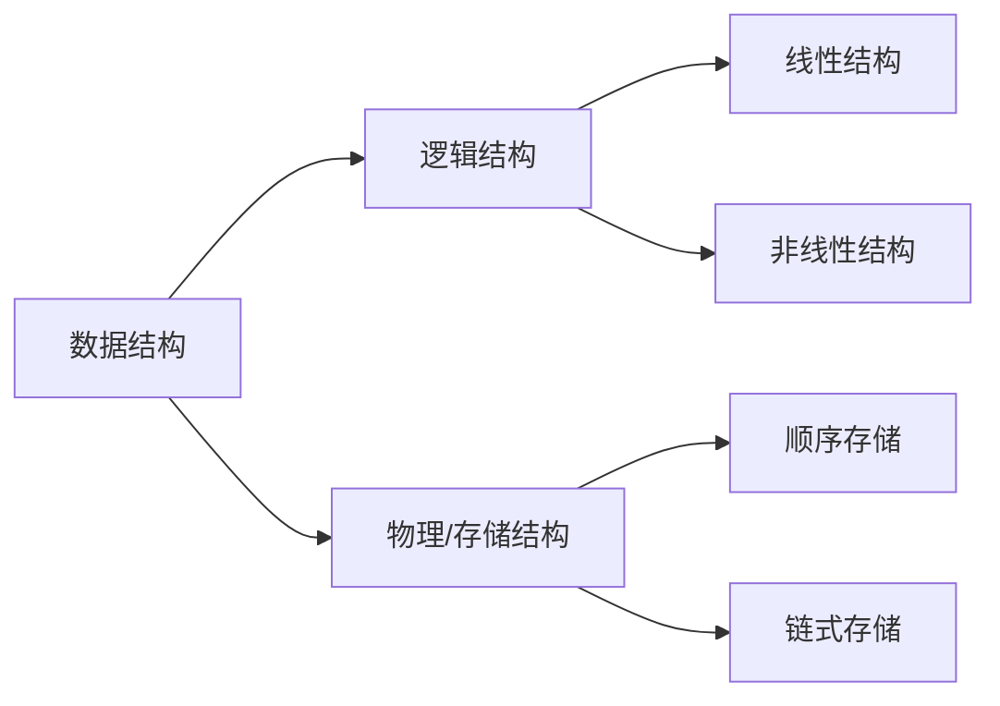

# :blue_book: 第二章 表(List)

本章主要讨论介绍最简单的数据结构：表，重点通过这个大家可能已经接触过的数据结构来介绍抽象数据类型、逻辑结构和物理结构等概念，
并且对于这三种数据结构的基本操作进行介绍。最后结合 Java 中重要的库类`ArrayList`和`LinkedList`进一步开展实战。

## 从数组开始

在开始本章内容之前，我们先来看一段稍早前就已经学习过的代码。

```java
public class Main {
    public static void main(String[] args) {
        int[] a = {1, 2, 3, 4, 5, 6, 7, 8, 9};
        System.out.println("The output is " + a[1]);
        a[1] = 5;
        System.out.println("The output is " + a[1]);
    }
}
```

这个代码定义了一个数组，先输出了数组的第二个元素，并修改了第二个元素。这就涉及到了 Java 中最基础的数据结构——数组。
可以看出，数组中是一系列同类数据的集合，并且有其规定的次序，当然数组的可操作性是有限的，Java 中还有包括更高级的`Array`类
来实现更高级的操作。但本质上这些数据结构都包含了一些常见基本的操作，如：增加、删除、修改等。实际上反映了 ==_物理上_== 数据如何存储。
为了更好地理解数据结构本身的性质，我们需要在逻辑上定义相应的数据结构，这里首先引入抽象数据类型(Abstract Data Type, ADT)
的概念。

## 抽象数据类型

**抽象数据类型**(Abstract Data Type, ADT)是带有一组特定操作的对象的集合，可以视作是数学层面的抽象，它并不关注特定语言算法的实现，
而更注重相关的逻辑操作，例如增加(add)，删除(delete)，修改(modify)，查找(find)等等，常用于数据结构的表示，更多体现的是
==_逻辑上_== 元素的组织及操作。在 Java 语言的设计中，也有类似 ADT 的实现，但是对其实现的细节进行了适当的隐藏。

## 逻辑结构与物理结构

在数组和抽象数据类型的介绍中，我们提到逻辑概念和物理概念，这两者实际上对应了计算机在数据存储时的逻辑结构与物理结构(
物理结构也称存储结构)。 其中，逻辑结构反应的是数据的逻辑组成，是具体操作层面的表示，而物理结构则是数据在计算机的物理介质(
硬盘、内存)等中的存储方式，是物理层面的数据结构。 例如我们常说的数组指的就是逻辑结构，而表则包含了逻辑结构和物理结构两层含义。

我们可以通过以下图来简要划分一下即将学习的数据结构中逻辑结构与物理结构，后续我们将详细介绍每种数据结构的逻辑结构，以及其对应的物理结构



## 表

在本课程中，我们将形式如$A_0,A_1,A_2,...,A_N$的一般数据所组成的连续数据集合的逻辑结构称之为**表(List)**[^1]，
我们前述的数组也是一种表的物理结构表示。为了便于表述，我们将长度为 0 的表称之为空表，其中没有任何元素。并将$A_i$称之为$A_
{i+1}$的前驱(previous)，将$A_{i+1}$称之为$A_{i}$的后继(next)。与之相对的，我们可以抽象一系列的操作，例如定义`printList`
来打印整个列表，定义`makeEmpty`清空列表，定义`find`根据下标来找回值，定义`insert`来在指定位置插入值，定义`remove`
移除指定位置的元素。

### 顺序表

顺序表又称顺序存储结构，专门用以存储一对一的数据。在是表这一逻辑结构在物理存储上的一种形式，所存储的应是一整块内存空间中的有次序的数据。
一般来说，顺序表的内存分配应当是连续的，因此在物理结构上是有连续次序的，因此，称之为顺序表。


:::info 注意
对于顺序表这个概念，在部分的以 Java 为编码语言教材中并没有刻意强调，与 C/C++ 等语言相比，由于 Java
的虚拟机机制，数据在内存中"顺序"并没有如 C/C++ 中体现那么明显。因此大多数情况下会将数组等同于顺序表这一逻辑结构的物理实现。但在
C/C++中对于内存的管理则更加标准，
顺序表中的"顺序"体现的更加明显
:::

然而在 Java 中，数组的灵活性有限，特别是需要增加或删除数据时，往往需要重新定义数组，并将数组指向新的变量，例如下述代码片段实现了一个数组的扩充，
实际上是需要新建一个数组来实现的。

```java
int[] arr = new int[10];
int[] expArr = new int[arr.length * 2];
for (int i = 0; i < arr.length; i++) {
    expArr[i] = arr[i];
}
arr = expArr;
```

更为极端的是，如果需要对数组进行插入和删除的操作，最差的情况下(例如在首位插入或删除元素)甚至需要遍历整个数组，这无疑是不合适的，为此，更为灵活的方式是使用
**链表**。

### 链表

链表(linked list)是一种类似链条一般的表，一般来说是有一系列节点组成，并且在内存中不必完全相连的数据所组成表集合。
每一个节点都包含该元素值和到包含该元素后继节点的链接，一般称之为 next，最后一个节点后继指向 null。 下图即展示了一个长度为 4
的链表，


我们可以看出，每个元素都有一个直接后继 next 指向下一个元素，而最后一个元素，设置了一个标识，表示没有后继，一般是
null。而对于链表数据操作时，进行
数据的查找和打印数据时，和数组的操作是一致的，而对于依据下标查找时，单链表的效率显然不如数组。相对于数组来说，链表的优势主要是增删的优势更大，
即找到相应的位置，调整 next 指向位置即可。

在删除节点时，首先要找到待删除节点位置，假设为$A_2$，接着我们将$A_2$的前驱（即：$A_1$）的后继(next)
指向$A_2$的后继，这样$A_1$和$A_2$之间链接就会断开，虽然此时$A_2$的 next 仍然指向$A_3$，但如果我们进行遍历或查找已经无法直接访问到$A_2$，
即完成了对节点的删除，下图展示了删除节点的操作示意。


:::info 注意
可以看出一个更为优雅的后续操作是，及时的释放$A_2$所占用的存储空间，由于 JVM 内建的内存回收机制，这一操作是在 Java
内存回收过程中完成的，
参见[Java Garbage Collection Basics | Oracle](https://www.oracle.com/webfolder/technetwork/tutorials/obe/java/gc01/index.html)
而对于
C/C++语言而言，则需要手动删除节点，参见[C++ Program for Deleting a Node in a Linked List | Geeksforgeeks.org](https://www.geeksforgeeks.org/cpp-program-for-deleting-a-node-in-a-linked-list/)
:::

对于增加节点而言，首先得有一个新插入的节点，假设我们新增一个$A_4$节点在$A_1$和$A_2$之间，那在新建这个待插入对象后，首先应将新建节点的后继
(next)指向待插入位置的后继，其次将待插入位置的之前元素的后继(next)指向新的节点，这样就完成了节点的新增，且自动的删除了原有链表之间的链接，
下图展示了增加节点的操作示意。


:::info 注意
在删除节点时，一定要先将新增节点后继指向待插入位置的后继，再将待插入节点前驱的后继指向新节点，如果出现相反操作。
:::

#### 循环链表

我们再看一个经典的算法问题
::: warning 问题 2.1: 约瑟夫环问题
已知$n$个人（分别用编号$1,2,3,...,n$表示）围坐在一张圆桌周围，从编号为$k$的人开始顺时针报数，数到$m$
的那个人出列；他的下一个人又从$1$开始，还是顺时针开始报数，数到$m$的那个人又出列；依次重复下去，直到圆桌上剩余一个人。

:::

如果我们还是用之前的单链表进行问题的解决，将面临着多次修改起始节点或重新声明变量的操作。而我们只需要稍微对单链表做一点修改，即将头与尾相连，即可很快的解决这个问题，这样的链表称之为循环链表(
circular linked list)。


循环链表与单链表最大的区别在于，循环链表的尾节点指向的不是终止符，而是链表的"头结点"。需要注意的是，在遍历循环链表等情况时，还需要对循环链表增加一个头结点标识。


那对于问题 2.1 的解决则简单的多。

#### 双向链表

但是如果我们对问题 2.1
做一个调整，每次报数都和上次的顺序相反，那循环链表的就难以适用了。为了知晓不同方向的前后关系，可以考虑的一种方式是，为每个节点做个前驱链接 (
previous)，那循环链表则又可以进一步增强灵活性，我们称这样的链表为双向循环链表。当然，也可以为单链表增加这样的前驱指向，则可以得到双向链表。


需要注意的是，双向链表同样需要指定截止符，即头结点的前驱为空，尾结点的后继为空。如果是双向循环链表，则需要将头尾链表全部链接起来。


## Java Collection 和 Iterator API

在讲述的表及相关变体后，进一步我们来看下如何使用 Java
语言进行数据结构的实现。前述提到[抽象数据类型](index.md/#抽象数据类型)
实际上定义的是数据的逻辑结构，而具体 ADT 在 Java 中如何表示，则需要利用到 Java 的 Collection API。

### Collection API 接口

Collection API 位于`java.util`包中，中文一般称之为集合，它存储了一组相同的对象，并且相关操作在`Collection`
接口中抽象得到，下述是部分`Collection`接口中常用的待实现的方法。

```java
public interface Collection<AnyType> extends Iterable<AnyType>{
    int size();//获得集合大小
    boolean isEmpty();//集合是否为空
    void clear();//清空集合
    boolean contains(AnyType x);//集合是否包含某个数据
    boolean add(AnyType x);//往集合中增加某个数据
    boolean remove(AnyType x);//从集合中删除某个数据
    Iterator<AnyType> iterator();//返回一个Iterator遍历器对象
}
```

我们可以看到，在 Collection API 中，使用了泛型，并从`Iterable`接口中继承了接口。其中常见需要实现的方法有：`size`
表示获得集合大小，`isEmpty`表示集合是否为空，`clear`表示清空集合，`contains`表示集合中是否包含某个数据，`add`
表示增加某个数据，`remove`表示移除某个数据。需要注意的是，在这里还包含一个返回 Iterator 对象的方法，从而便于更好的调用
Iterator 接口中高效的[迭代方法](https://docs.oracle.com/javase/8/docs/api/java/util/Iterator.html)。

### Iterator API 接口

要实现上述`Collection`接口必须要提供一个名为`iterator`的方法，它返回了一个`Iterator`对象，而`Iterator`接口作为`java.util`
包中定义的接口，其基本操作如下：

```java
public interface Iterator<AnyType>{
    boolean hasNext();//是否有后继
    AnyType next();//向后移一位
    void remove();//删除当前数据
}
```

其中`hasNext`是判断当前对象是否有后继，`next`
表示获得集合的下一项，第一次调用时获得的是第一项，第二次则是第二项，以此类推，`remove`表示删除由`next`
返回的最新一项，要注意的是这个方法只有在`next`方法调用后才可以被合法的调用，否则会返回`IllegalStateException`
异常。这与`Collection`接口的`remove`方法有所区别。另外还需要注意的是，如果当前`Iterator`
对象出现了结构上的变化，例如使用了`add`，`remove`
等方法后，迭代器将发生结构变化，此时如果再使用迭代器时将抛出`UnsupportedOperationException`异常。为此，一般只在需要使用迭代器时，才获取当前的迭代器对象。

## List, ArrayList 和 LinkedList 类

在了解了`Collection`和`Iterator`接口后，具体到本章所提到的表（List），在 Java
中是以什么形式表示的。它同样继承于`java.util.Collection`接口，除了`Collection`的基本操作外，还有外加的其他方法。其中部分方法如下：

### List 的基本操作

```java
public interface List<AnyType> extends Collection<AnyType>{
    AnyType get(int idx); //获取某个下标对应的元素
    AnyType set(int idx, AnyType newVal); // 为某个下标设置对应值
    void add(int idx, AnyType x); //在某个下标增加某个元素
    void remove(int idx); //移除某下标的对应元素
    ListIterator<AnyType> listIterator(int pos); //List迭代器
}
```

:::info 注意
在 List 接口中，远远不止上述方法，同时在`Collection`的方法也有同名方法，请注意鉴别。另外 List 的下标与数组类似，也是从 0 开始计数。
:::

而在具体地实战中，主要有两种主流的实现方式：其一是使用`ArrayList`类来实现，其优势是`get`和`set`的调用耗费的是常数级复杂度，但是其插入和删除代价较大，可以直观的理解为`ArrayList`是类似数组一样的顺序表；其二是使用`LinkedList`，它实际上提供了类似双链表的实现，这就为插入和删除节点带来了非常大的优势，但显而易见的，由于链式存储的特性，使得`get`和`set`等方法的时间复杂度要高于`ArrayList`。

### ArrayList 类的具体实现

在本节，就具体来看下如何手写一个`ArrayList`类，为了避免和类库中的类重名，我们将该类命名为`MyArrayList`，为了简化表述，这里仅提供基础的`ArrayList`接口，不涉及`Collection`或`List`的方法。

我们再次回顾一下前述内容对顺序表的定义，实际上最简单的办法是使用数组的方式实现。为此，会涉及到基本数组的维护、访存、修改、遍历等操作

```java
public class MyArrayList<AnyType> implements Iterable<AnyType> {
    private static final int DEFAULT_CAPACITY = 10;
    private int theSize;
    private AnyType[] theItems;

    public MyArrayList() {
        doClear();
    }

    public void clear() {
        doClear();
    }

    private void doClear() {
        theSize = 0;
        ensureCapacity(DEFAULT_CAPACITY);
    }

    public int size() {
        return theSize;
    }

    public boolean isEmpty() {
        return size() == 0;
    }

    public void trimToSize() {
        ensureCapacity(size());
    }

    public AnyType get(int idx) {
        if (idx < 0 || idx >= size())
            throw new ArrayIndexOutOfBoundsException();
        return theItems[idx];
    }

    public AnyType set(int idx, AnyType newVal) {
        if (idx < 0 || idx >= size())
            throw new ArrayIndexOutOfBoundsException();
        AnyType old = theItems[idx];
        theItems[idx] = newVal;
        return old;
    }

    public void ensureCapacity(int newCapacity) {
        if (newCapacity < theSize)
            return;
        AnyType[] old = theItems;
        theItems = (AnyType[]) new Object[newCapacity];
        for (int i = 0; i < size(); i++)
            theItems[i] = old[i];
    }

    public boolean add(AnyType x) {
        add(size(), x);
        return true;
    }

    public void add(int idx, AnyType x) {
        if (theItems.length == size())
            ensureCapacity(size() * 2 + 1);
        for (int i = theSize; i > idx; i--)
            theItems[i] = theItems[i - 1];
        theItems[idx] = x;
        theSize++;
    }

    public AnyType remove(int idx) {
        AnyType removeItem = theItems[idx];
        for (int i = idx; i < size() - 1; i++)
            theItems[i] = theItems[i + 1];
        theSize--;
        return removeItem;
    }

    public java.util.Iterator<AnyType> iterator() {
        return new ArrayListIterator();
    }

    private class ArrayListIterator implements java.util.Iterator<AnyType> {
        private int current = 0;

        public boolean hasNext() {
            return current < size();
        }

        public AnyType next() {
            if (!hasNext())
                throw new java.util.NoSuchElementException();
            return theItems[current++];
        }

        public void remove() {
            MyArrayList.this.remove(--current);
        }
    }
}

```

### LinkedList 类的具体实现

在本节，就具体来看下如何手写一个`LinkedList`类，为了避免和类库中的类重名，我们将该类命名为`MyLinkedList`，为了简化表述，这里仅提供基础的`LinkedList`接口，不涉及`Collection`或`List`的方法。此时，我们需要思考几个问题：(1)如何构建链表关系；(2)如何维护链表节点；(3)如何控制头尾。

```java
public class MyLinkedList<AnyType> implements Iterable<AnyType> {
    private static class Node<AnyType> {
        public Node(AnyType d, Node<AnyType> p, Node<AnyType> n) {
            data = d;
            prev = p;
            next = n;
        }

        public AnyType data;
        public Node<AnyType> prev;
        public Node<AnyType> next;
    }

    public MyLinkedList() {
        doClear();
    }

    public void clear() {
    }

    public int size() {
        return theSize;
    }

    public boolean isEmpty() {
        return size() == 0;
    }

    public boolean add(AnyType x) {
        add(size(), x);
        return true;
    }

    public void add(int idx, AnyType x) {
        addBefore(getNode(idx, 0, size()), x);
    }

    public AnyType get(int idx) {
        return getNode(idx).data;
    }

    public AnyType set(int idx, AnyType newVal) {
        Node<AnyType> p = getNode(idx);
        AnyType oldVal = p.data;
        p.data = newVal;
        return oldVal;
    }

    public AnyType remove(int idx) {
        return remove(getNode(idx));
    }

    private void doClear() {
        beginMarker = new Node<AnyType>(null, null, null);
        endMarker = new Node<AnyType>(null, null, null);
        beginMarker.next = endMarker;
        theSize = 0;
        modCount++;
    }

    private void addBefore(Node<AnyType> p, AnyType x) {
        Node<AnyType> newNode = new Node<AnyType>(x, p.prev, p);
        newNode.prev.next = newNode;
        p.prev = newNode;
        theSize++;
        modCount++;
    }

    private AnyType remove(Node<AnyType> p) {
        p.next.prev = p.prev;
        p.prev.next = p.next;
        theSize--;
        modCount++;
        return p.data;
    }

    private Node<AnyType> getNode(int idx) {
        return getNode(idx, 0, size() - 1);
    }

    private Node<AnyType> getNode(int idx, int lower, int upper) {
        Node<AnyType> p;
        if (idx < lower || idx > upper)
            throw new IndexOutOfBoundsException();
        if (idx < size() / 2) {
            p = beginMarker.next;
            for (int i = 0; i < idx; i++)
                p = p.next;
        } else {
            p = endMarker;
            for (int i = size(); i > idx; i--)
                p = p.prev;
        }
        return p;
    }

    public java.util.Iterator<AnyType> iterator() {
        return new LinkedListIterator();
    }

    private class LinkedListIterator implements java.util.Iterator<AnyType> {
        private Node<AnyType> current = beginMarker.next;
        private int expectedModCount = modCount;
        private boolean okToRemove = false;

        public boolean hasNext() {
            return current != endMarker;
        }

        public AnyType next() {
            if (modCount != expectedModCount)
                throw new java.util.ConcurrentModificationException();
            if (!hasNext())
                throw new java.util.NoSuchElementException();
            AnyType nextItem = current.data;
            current = current.next;
            okToRemove = true;
            return nextItem;
        }

        public void remove() {
            if (modCount != expectedModCount)
                throw new java.util.ConcurrentModificationException();
            if (!okToRemove)
                throw new IllegalStateException();
            MyLinkedList.this.remove(current.prev);
            expectedModCount++;
            okToRemove = false;

        }
    }

    private int theSize;
    private int modCount = 0;
    private Node<AnyType> beginMarker;
    private Node<AnyType> endMarker;
}

```
#### 注

[^1]: 在中文教程不同版本的表述中，表也有被称之为列表、线性表，但本质上都是对数据结构的逻辑层面的表述，为避免歧义，我们将统称为表
