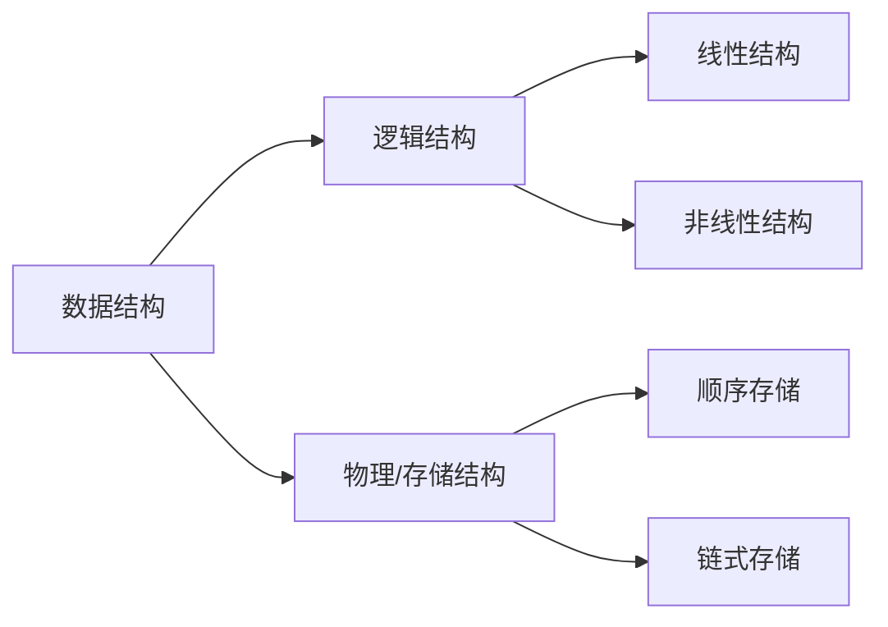

# :blue_book: 第二章 表、栈和队列

本章主要讨论介绍最简单的三种基本数据结构：表、栈和队列，重点通过这三个大家可能已经接触过的数据结构来介绍抽象数据类型等概念，
并且对于这三种数据结构的基本操作进行介绍。最后结合Java中重要的库类`ArrayList`和`LinkedList`进一步开展实战。

## 从数组开始

在开始本章内容之前，我们先来看一段稍早前就已经学习过的代码。

```java
public class Main {
    public static void main(String[] args) {
        int[] a = {1, 2, 3, 4, 5, 6, 7, 8, 9};
        System.out.println("The output is " + a[1]);
        a[1] = 5;
        System.out.println("The output is " + a[1]);
    }
}
```

这个代码定义了一个数组，先输出了数组的第二个元素，并修改了第二个元素。这就涉及到了Java中最基础的数据结构——数组。
可以看出，数组中是一系列同类数据的集合，并且有其规定的次序，当然数组的可操作性是有限的，Java中还有包括更高级的`Array`类
来实现更高级的操作。但本质上这些数据结构都包含了一些常见基本的操作，如：增加、删除、修改等。实际上反映了 ==*物理上*== 数据如何存储。
为了更好地理解数据结构本身的性质，我们需要在逻辑上定义相应的数据结构，这里首先引入抽象数据类型(Abstract Data Type,
ADT)的概念。

## 抽象数据类型

**抽象数据类型**(Abstract Data Type, ADT)是带有一组特定操作的对象的集合，可以视作是数学层面的抽象，它并不关注特定语言算法的实现，
而更注重相关的逻辑操作，例如增加(add)，删除(delete)，修改(modify)，查找(find)等等，常用于数据结构的表示，更多体现的是 ==
*逻辑上*== 元素的组织及操作。在Java语言的设计中，也有类似ADT的实现，但是对其实现的细节进行了适当的隐藏。
本章节主要对于常见的三种基本数据结构的ADT来洞察进一步的具体实现。

## 逻辑结构与物理结构

在数组和抽象数据类型的介绍中，我们提到逻辑概念和物理概念，这两者实际上对应了计算机在数据存储时的逻辑结构与物理结构（物理结构也称存储结构）。
其中，逻辑结构反应的是数据的逻辑组成，是具体操作层面的表示，而物理结构则是数据在计算机的物理介质（硬盘、内存）等中的存储方式，是物理层面的数据结构。
例如我们常说的数组值得就是逻辑结构，而表则包含了逻辑结构和物理结构两层含义。

我们可以通过以下图来简要划分一下即将学习的数据结构中逻辑结构与物理结构，后续我们将详细介绍每种数据结构的逻辑结构，以及其对应的物理结构



## 表

在本课程中，我们将形式如$A_0,A_1,A_2,...,A_N$的一般数据所组成的连续数据集合的逻辑结构称之为**表(List)**，
我们前述的数组也是一种表的物理结构表示。为了便于表述，我们将长度为0的表称之为空表，其中没有任何元素。并将$A_i$称之为$A_
{i+1}$的前驱，将$A_{i+1}$称之为$A_{i}$的后继。与之相对的，我们可以抽象一系列的操作，例如定义`printList`来打印整个列表，
定义`makeEmpty`清空列表，定义`find`根据下标来找回值，定义`insert`来在指定位置插入值，定义`remove`移除指定位置的元素[^表]。

### 顺序表

顺序表又称顺序存储结构，专门用以存储一对一的数据。在是表这一逻辑结构在物理存储上的一种形式，所存储的应是一整块内存空间中的有次序的数据。
一般来说，顺序表的内存分配应当是连续的，因此在物理结构上是有连续次序的，因此，称之为顺序表。


:::info 注意
对于顺序表这个概念，在部分的以 Java 为编码语言教材中并没有刻意强调，与 C/C++ 等语言相比，由于 Java 的虚拟机机制，数据在内存中"顺序"并没有如
C/C++ 中体现那么明显。因此大多数情况下会将数组等同于顺序表这一逻辑结构的物理实现。
:::

### 链表

## 栈

**栈(Stack)**

### 顺序栈

### 链栈

## 队列

**队列(Queue)**

[^表]: 在中文教程不同版本的表述中，表也有被称之为列表、线性表，但本质上都是对数据结构的逻辑层面的表述，为避免歧义，我们将统称为表
